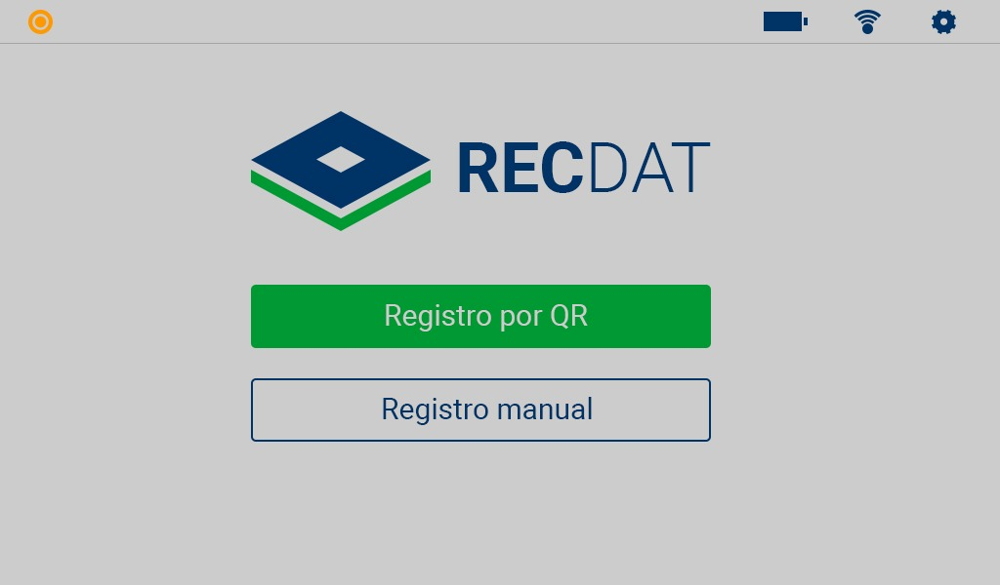
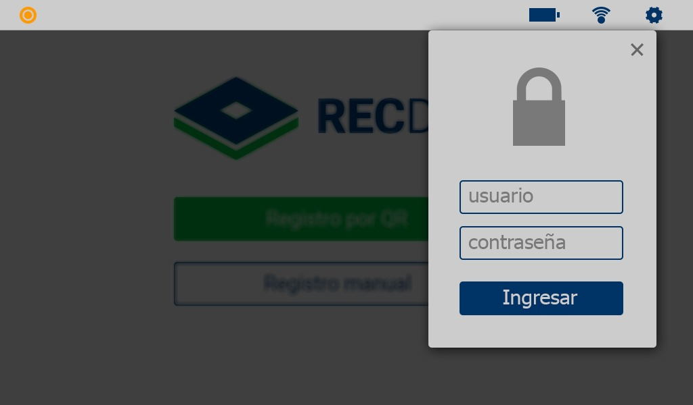
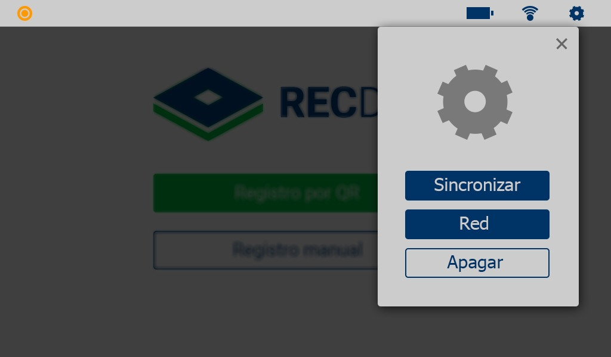

# RECDAT - Registro y Control de Asistencias

Sistema de registro y control de asistencias para instituciones educativas, diseñado para ejecutarse en Raspberry Pi y equipos de escritorio mediante Electron.

## 📋 Descripción

RECDAT permite registrar y administrar asistencias de docentes mediante una interfaz intuitiva, almacenamiento local con SQLite y sincronización remota utilizando Firebase.

### Características principales

- ✅ Inicio de sesión con autenticación de usuarios.
- ✅ Registro y consulta de asistencias.
- ✅ Generación y lectura de códigos QR.
- ✅ Sincronización de datos con Firebase.
- ✅ Gestión de redes WiFi desde la aplicación.
- ✅ Monitoreo del estado de batería.
- ✅ Funcionamiento offline con base de datos SQLite.
- ✅ Diseñado para Raspberry Pi y Linux ARM.

---

## 🛠️ Tecnologías utilizadas

- Electron
- JavaScript
- HTML5
- CSS3
- SQLite3
- Firebase Admin SDK
- Node.js
- Node-Wifi
- SweetAlert2

---

## 📸 Capturas de pantalla

### Pantalla principal



### Ajustes



### Configuración de red



### Personalización


---

## 📂 Estructura del proyecto

```text
recdat/
│
├── assets/
├── database/
│   ├── assistances.db
│   └── assistances.sql
│
├── img/
│
├── src/
│   ├── scripts/
│   ├── styles/
│   ├── utils/
│   ├── views/
│   ├── index.js
│   ├── renderer.js
│   ├── preload.js
│   └── index.html
│
├── package.json
└── forge.config.js
```

---

## 🚀 Instalación

### 1. Clonar el repositorio

```bash
git clone https://github.com/usuario/recdat.git
cd recdat
```

### 2. Instalar dependencias

```bash
npm install
```

### 3. Configurar Firebase

Agregar el archivo de credenciales de Firebase:

```text
settings/
└── firebase-admin-sdk.json
```

Actualizar la ruta correspondiente en:

```javascript
src/index.js
```

---

## ▶️ Ejecutar en modo desarrollo

```bash
npm start
```

---

## 📦 Generar paquete de distribución

### Electron Forge

```bash
npm run package
```

### Generar instaladores

```bash
npm run make
```

### Raspberry Pi (ARM)

```bash
npm run packager
```

---

## 🗄️ Base de datos

La aplicación utiliza SQLite para almacenamiento local.

Archivo principal:

```text
database/assistances.db
```

Script de creación:

```text
database/assistances.sql
```

---

## 🔄 Sincronización

RECDAT permite sincronizar la información almacenada localmente con Firebase para garantizar la disponibilidad de los registros y respaldos remotos.

---

## 🔐 Seguridad

- Contraseñas protegidas mediante bcrypt.
- Sanitización de nombres de archivos.
- Validaciones de acceso en la interfaz.

---

## 📌 Requisitos

### Desarrollo

- Node.js 18+
- npm 9+
- Electron 30+

### Raspberry Pi

- Raspberry Pi OS
- Arquitectura ARMv7 o superior
- Conexión WiFi (opcional para sincronización)

---

## 👨‍💻 Autor

**Juan Cueto Morelo, Elias Ballestero**

- GitHub: https://github.com/Jcuetomorelo37
- GitHub: https://github.com/EliasBAlle
- Email: cuetoreach@gmail.com

---

## 📄 Licencia

Este proyecto está distribuido bajo la licencia MIT.
